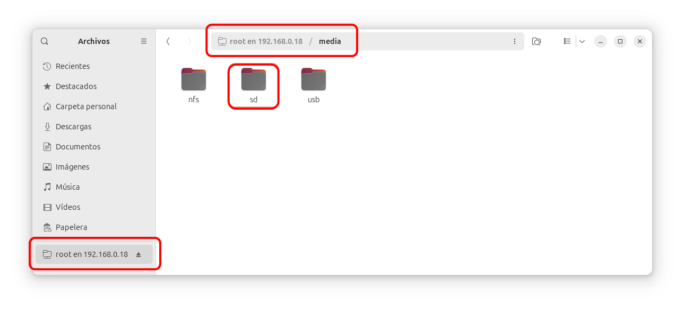
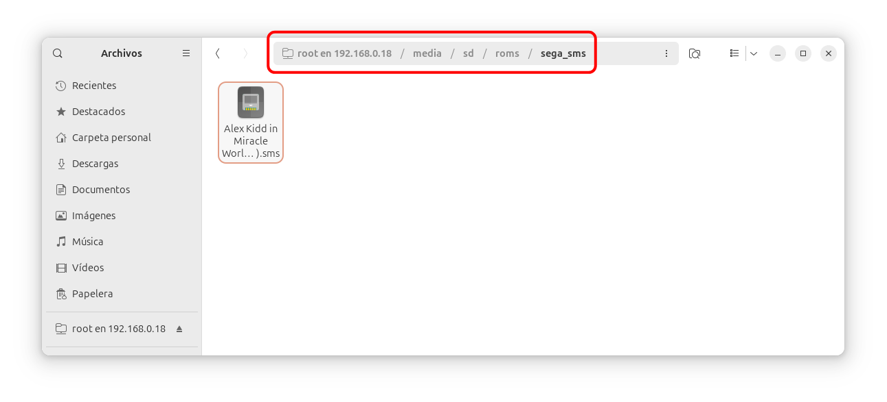

# Adding Games

Before playing games, you must copy them to your MicroSD, USB, or NFS.

## Choose Storage Device

RePlay OS automatically creates the required folder structure once the desired storage device is selected from the system options. Follow these steps to select your storage device from `REPLAY OPTIONS > SYSTEM > STORAGE`:

* `INTERNAL SD CARD`: This is a FAT partition created and expanded on the first boot, already prepared for use.
* `EXTERNAL USB DRIVE`: Select this option if you want to use a pendrive or USB unit. Avoid mechanical drives, especially non-powered ones, to prevent power and performance drops. The unit must be manually formatted in FAT32 or exFAT before plugging it into the Raspberry Pi.
* `INTERNAL NVME DRIVE`: This option makes use of the Raspberry Pi 5 PCIe NVMe M.2 interface for storage. 
* `NETWORK NFS SHARE`: Select this option to use your own server share. Ensure the unit has read/write rights for the system to create folders and files.

Once you have selected the desired storage device and the folder structure is in place, you can proceed with transferring your games.

### A Note About NFS Share

The configuration of the NFS share must be done manually in the `replay.cfg` file located in `/media/sd/config/replay.cfg`:

```python
nfs_server = "192.168.X.X"
nfs_share = "/export/share"
```

After restarting the system, you can check the new configuration from `REPLAY OPTIONS > INFORMATION > NFS SERVER / NFS SHARE`.

## Transfer ROMs Over the Network via SFTP

SFTP (Secure File Transfer Protocol) is used to access and transfer files over the network.

Before connecting from your PC to RePlay OS, you need to know its IP address. If you have plugged in a network cable, you can find your IP from `REPLAY OPTIONS > INFORMATION > ETHERNET IP`.

You will need an SFTP client program to connect to RePlay OS. Popular tools for accessing via SFTP are:

* [Filezilla](https://filezilla-project.org/)
* [WinSCP](https://winscp.net/eng/download.php)

If your main host PC uses a Linux distribution, you don't need any specific client program (as shown in the screenshots below).

Use your RePlay OS IP address and port 22 to connect. The credentials are: `root / replayos`.

In the example below, we are copying a SEGA Master System game to the corresponding `/roms/sega_sms/` folder:




## Transfer ROMs to the MicroSD

You can turn off your Raspberry Pi, remove the MicroSD card, and plug it into your computer to transfer ROMs. A FAT formatted partition named `replay` will be available from your file browser.

## Supported File Formats

Please check the supported file formats for ROMs and CD images from the [Compatibility Matrix](systems.md#compatibility-matrix).

Note that to save RAM and improve boot times, RePlay OS only supports compressed `zip` files for a limited number of systems.

For information about M3U multi-disc support please check [M3U Multi-Disc Management](m3u.md) from the advanced Wiki section.