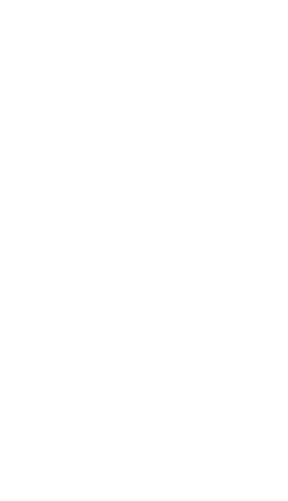

# Folder Structure

## Root storage folders
RePlay OS utilizes a well-defined folder structure for MicroSD, USB, and NFS units. The root path, shown below, is where these directories can be found. This structure is also automatically displayed when accessing the system via SFTP:

## Child data folders

Whether you are using the internal the MicroSD FAT partition, USB unit or NFS share, the system will create the following folder structure inside any of these folders:

## bios folder
It is where all system BIOS, arcade samples, sound fonts, computer special core configurations, and any other special system file are stored.

## catures folder
This is the place where screenshots are stored.

## config folder
This is where all input and core configurations are saved. The different configurations can be applied to the entire system, specific games, or particular types of TVs, whether LCD or CRT.

## roms folder
This is where you can copy your game files. The system folders are prefixed by the company name for better categorization. Additionally, there are special system folders prefixed with an underscore, such as `_autostart`, `_extra`, `_favorites`, and `_recent`.

## saves folder
This folder contains all user save states and native system saves. Other special system preference files could be also saved here.