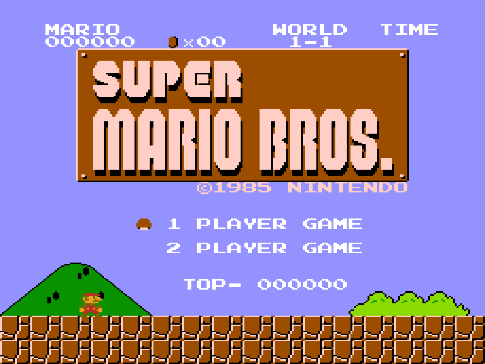
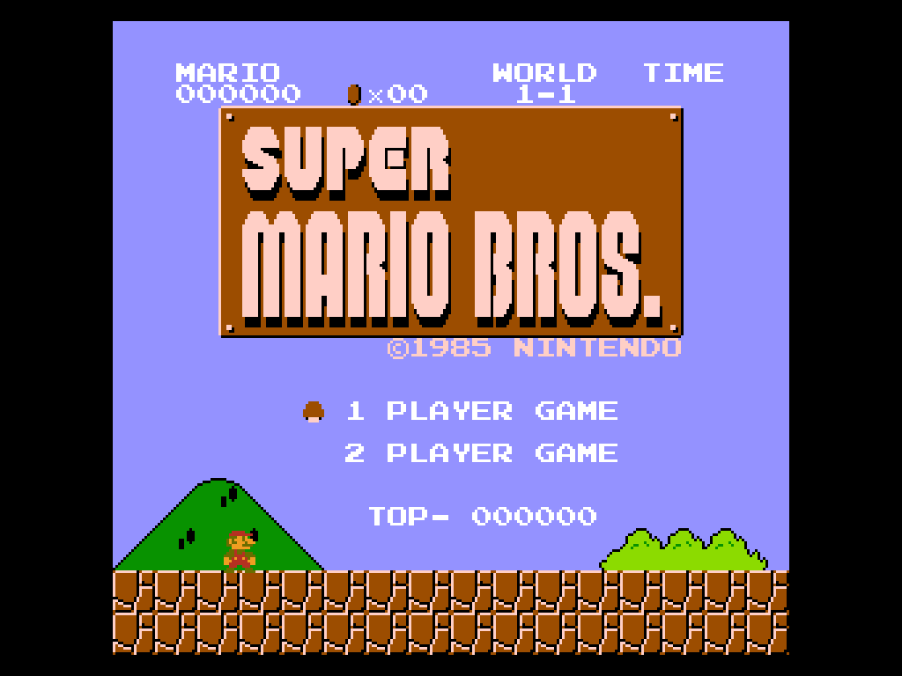
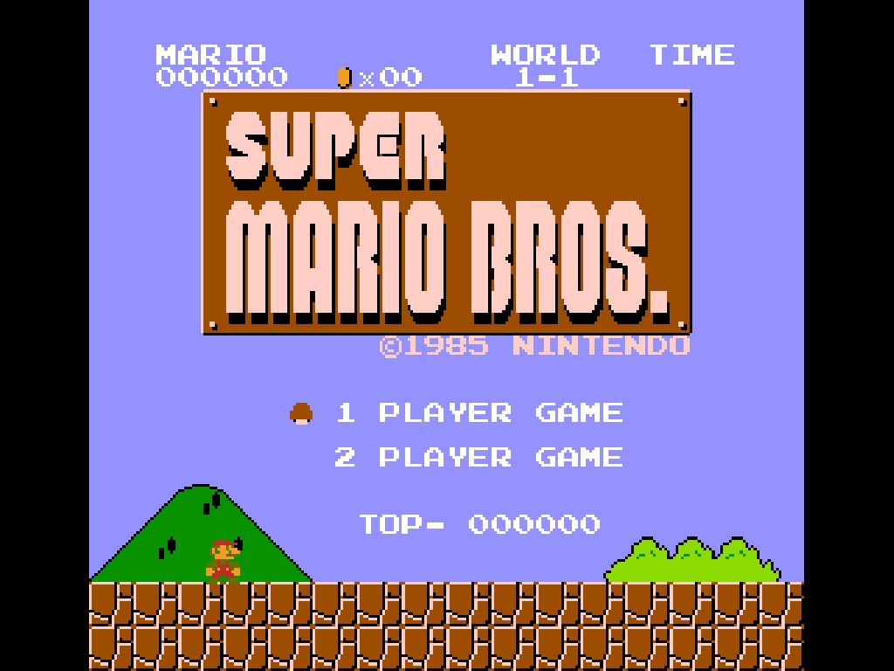
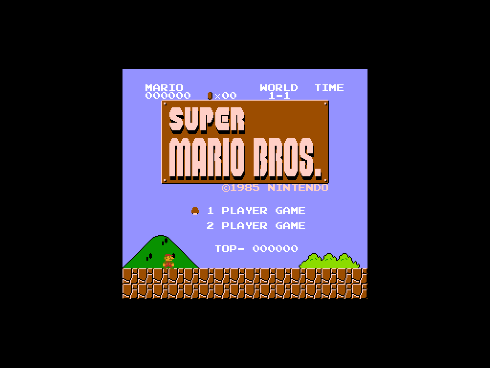
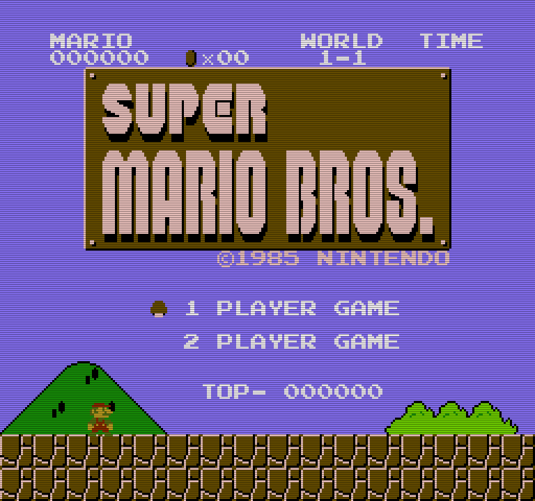
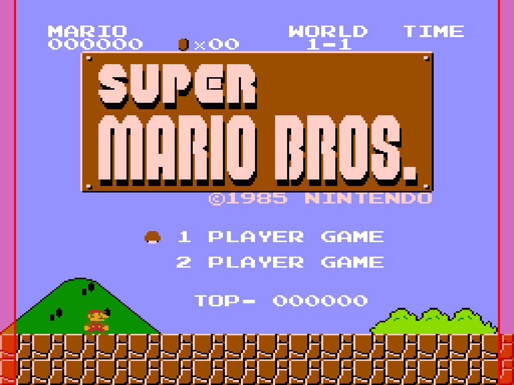

# Video Configuration

Below you can find a description of some basic video configurations and features on RePlay OS. You can change the resolution, add some video filters, adjust the overscan, select different scaling modes, enable dual screen, and more.

## Screen Mode

You can select the desired screen mode from `REPLAY OPTIONS > VIDEO > SCREEN MODE`:

* `CRT/LCD AUTO`: this mode automatically selects the type (CRT or LCD), and native default resolution of your monitor. However, please note that this only applies to resolutions up to 1920x1080 for LCD. This limitation ensures backward compatibility with all Raspberry Pi models and addresses performance considerations. Consequently, even if you have a 4K monitor, the system will configure it to a maximum resolution of 1920x1080.
* `CRT 320X240@VRR`: this enables analog video support in 240p mode, which is the standard for any commercial CRT TV. It uses native variable refresh rates for each system/game. It is also able to automatically scale to 480p when used with high-resolution arcade 31kHz monitors, such as those found in NAOMI cabinets.
* `LCD 1920X1080@60`
* `LCD 1280X720@60`
* `LCD 1280X1024@60`
* `LCD 1024X768@60`
* `LCD 1440X1440@90`: this is a special mode only for internal use.
* `LCD 1920X1080@60/50`: this mode can switch between 60Hz and 50Hz, accommodating PAL games or arcade games that operate close to 50Hz (could not work in all TVs).
* `LCD 1280X720@60/50`
* `LCD 1024x768@70`: this is a special XGA mode.
* `LCD 2560x1440@60`: experimental 2K resolution for Raspberry PI 5 and higher.
* `LCD 3840x2160@60`: experimental 4K resolution for Raspberry PI 5 and higher.

**NOTE:** when changing between LCD and CRT modes, you must reboot the system to apply the configuration.

## Dual Screen Mode

RePlay OS is able to make use of dual screen configuration in both LCD and CRT configurations. You can select different modes from `REPLAY OPTIONS > VIDEO > DUAL SCREEN MODE`:

* `OFF`: for single screen configuration.
* `DUPLICATE`: clones the image in both screens. Useful for streaming or recreating arcades like Sega Versus City. 
* `HORIZONTAL`: uses both screens in horizontal extended way. Useful for dual screen arcade games like Sagaia or OutRunners.
* `VERTICAL`: uses both screens in vertical extended way. Usefull for arcades like Punch-Out or Nintendo DS.

## CRT Type

Allows you to choose different TV and monitor types. Choose TV 15kHz for regular TVs.

## Gamma, RGB Color Intensity and Screen X/Y Position

You can fully customize various screen parameters, such as gamma, RGB color channel intensity (to adjust CRTs with degraded channels), and screen position on both LCD and CRT displays.

## Aspect Ratio

This allows you to choose different display modes when playing on LCD screens (CRT always uses a native aspect ratio) from `REPLAY OPTIONS > VIDEO > ASPECT RATIO`:

* `FULL SCRN 4:3`: Displays the game image at full screen in 4:3, like a CRT TV.
* `FULL SCRN NATIVE`: Scales fullscreen using the internal system native aspect ratio (e.g., NES/SNES 8:7).
* `INT-V 4:3-H`: Scales the vertical resolution using an integer factor while maintaining a 4:3 aspect ratio for the horizontal resolution.
* `INT-V NATIVE-H`: Scales the vertical resolution using an integer factor while scaling the horizontal resolution to match the game's native aspect ratio.
* `INT-H 4:3-V`: Scales the horizontal resolution using an integer factor while maintaining a 4:3 aspect ratio for the vertical resolution.
* `INT-H NATIVE-V`: Scales the horizontal resolution using an integer factor while scaling the vertical resolution to match the game's native aspect ratio.
* `INT-HV`: Performs an integer scale to the maximum area allowed by the screen resolution.
* `INT-HV OVER`: Uses an integer overscaling mode to extend the image over 1080p, nearly displaying the original overscan of a CRT. This works only with 1080p screen modes.
* `INT-HV UNDER`: A special mode for performing integer underscale for internal use.

| **FULL SCRN 4:3** | **INT-HV** |
|:----------------------------------:|:------------------:|
| {width="360"} | {width="360"} |
| **FULL SCRN NATIVE** | **INT-HV OVER** |
| {width="360"} | {width="360"} |
| **INT-HV UNDER** | |
| {width="360"} ||

## Scan Lines

This options allows you to add some texture to the image using a custom scanline filter. This mode can be only used with LCD screens when using any vertical integer scaling mode, or CRT 31kHz PC/Arcade monitors.

| **Light** |
|:----------------------------------:|
|  |
| **Medium** |
|  |
| **Strong** |
|  |
| **Black** |
|  |

## Overscan Reduction

This option is designed to reduce horizontal overscan when using CRT TVs, providing a wider visible area on the left and right borders of the screen while maintaining an integer scale image. In the image below, the red area indicates what is normally drawn in the overscan region and is not visible on standard CRT TVs.

{width="768"}